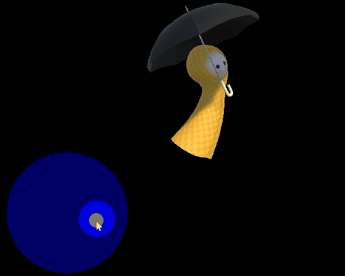
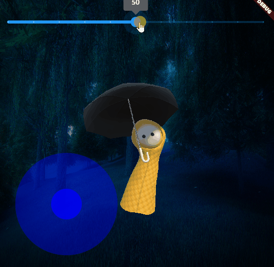

# yomo

Demonstration of sprite animation with Flutter and Flame. The character
is named Yomo.

Prior to writing the Flutter code, the sprites were created by downloading a 3D asset and converting the 3D assets into 2D image sequences.

Slider is a Flutter widget.  The Flame GameWidget and the Flutter Slider
widget are in a Flutter Stack.

State is managed by passing an instance of FlameGame to the Stateless widget
with the Slider.

## techniques demonstrated

* flame virtual joystick
* flame sprite animation group
* flutter slider to alter flame state
